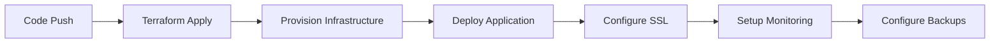

# Dream Vacation Destinations - DevOps Capstone Project

A full-stack application that allows users to create and manage their dream vacation destinations list, built with modern DevOps practices including Infrastructure as Code, CI/CD pipelines, automated deployments, and comprehensive backup systems.

## 🏗️ Architecture Overview

This project demonstrates a production-ready application with:
- **Frontend**: React.js application served via Docker
- **Backend**: Node.js/Express API with PostgreSQL database
- **Infrastructure**: AWS EC2 with Terraform (IaC)
- **CI/CD**: GitHub Actions workflows
- **Monitoring**: AWS CloudWatch integration
- **SSL**: Automated SSL certificate management
- **Backup**: Automated PostgreSQL backups to S3
- **Domain**: Custom domain with Route53 DNS management

## 🚀 Live Application

- **Production URL**: [https://dream.temmytope.online](https://dream.temmytope.online)

## 📁 Project Structure

```
kc-devops-capstone/
├── .github/
│   └── workflows/
│       ├── backend.yaml          # Backend CI pipeline
│       ├── frontend.yaml         # Frontend CI pipeline
│       └── deploy.yaml           # Infrastructure & deployment pipeline
├── backend/                      # Node.js/Express API
│   ├── server.js
│   ├── package.json
│   └── Dockerfile
├── frontend/                     # React.js application
│   ├── src/
│   ├── public/
│   ├── package.json
│   └── Dockerfile
├── terraform/                    # Infrastructure as Code
│   ├── modules/
│   │   ├── network/             # VPC, subnets, routing
│   │   ├── instance/            # EC2 instances, security groups
│   │   ├── cloudwatch/          # Monitoring and logging
│   │   └── route/               # Route53 DNS management
│   ├── main.tf
│   ├── provider.tf
│   └── backend.tf
├── scripts/                     # Automation scripts
│   ├── pg-db-backup.sh          # PostgreSQL backup script
│   ├── save_to_s3.py            # S3 upload utility
│   ├── setup-backup-cron.sh     # Automated backup setup
│   ├── verify-backup-cron.sh    # Backup verification
│   ├── certbot-nginx-config.sh  # SSL certificate automation
│   └── README-backup-cron.md    # Backup system documentation
├── docker-compose.yaml          # Multi-container orchestration
└── README.md                    # This file
```

## 🛠️ Technologies & Tools

### Application Stack
- **Frontend**: React 18, Axios, React Scripts
- **Backend**: Node.js, Express.js, PostgreSQL driver
- **Database**: PostgreSQL 15
- **External API**: REST Countries API

### DevOps & Infrastructure
- **Infrastructure as Code**: Terraform 1.9.0
- **Cloud Provider**: AWS (EC2, VPC, Route53, CloudWatch, S3)
- **Containerization**: Docker & Docker Compose
- **CI/CD**: GitHub Actions
- **SSL/TLS**: Let's Encrypt with Certbot
- **Monitoring**: AWS CloudWatch
- **Backup**: Automated PostgreSQL dumps to S3

### Development Tools
- **Version Control**: Git & GitHub
- **Package Management**: npm
- **Environment Management**: Docker containers
- **Documentation**: Markdown

## 🏃‍♂️ Quick Start

### Prerequisites
- Docker and Docker Compose
- AWS Account with appropriate permissions
- Domain name (for production deployment)

### Local Development

1. **Clone the repository**
   ```bash
   git clone <repository-url>
   cd kc-devops-capstone
   ```

2. **Set up environment variables**
   ```bash
   cp .env.example .env
   # Edit .env with your database credentials
   ```

3. **Start the application**
   ```bash
   docker-compose up -d
   ```

4. **Access the application**
   - Frontend: http://localhost:3000
   - Backend API: http://localhost:3001
   - Database: localhost:5432

### Production Deployment

The application automatically deploys to AWS when changes are pushed to the `dev` branch using GitHub Actions.

## 🔄 CI/CD Pipeline

### Workflow Structure

1. **Backend CI** (`.github/workflows/backend.yaml`)
   - Triggers on backend code changes
   - Builds and tests Node.js application
   - Creates Docker image
   - Pushes to Docker Hub

2. **Frontend CI** (`.github/workflows/frontend.yaml`)
   - Triggers on frontend code changes
   - Builds React application
   - Creates optimized Docker image
   - Pushes to Docker Hub

3. **Infrastructure & Deployment** (`.github/workflows/deploy.yaml`)
   - Provisions AWS infrastructure with Terraform
   - Deploys application to EC2
   - Configures SSL certificates
   - Sets up monitoring and backups

### Deployment Process



## 🏗️ Infrastructure Details

### AWS Resources

- **VPC**: Custom Virtual Private Cloud (10.0.0.0/16)
- **EC2**: t2.micro instance running Docker containers
- **Security Groups**: Configured for HTTP/HTTPS/SSH access
- **Route53**: DNS management for custom domain
- **CloudWatch**: Instance monitoring and logging
- **S3**: Database backup storage

### Terraform Modules

- **Network Module**: VPC, subnets, internet gateway, route tables
- **Instance Module**: EC2 instances, security groups, key pairs
- **CloudWatch Module**: Monitoring, alarms, log groups
- **Route Module**: DNS records, domain management

## 💾 Backup System

### Automated PostgreSQL Backups

The project includes a comprehensive backup system that:
- Runs automated database backups every 3 days at 2:00 AM
- Stores compressed SQL dumps locally and uploads to S3
- Automatically cleans up old local backups (7-day retention)
- Provides verification and monitoring tools

### Backup Components

1. **`pg-db-backup.sh`**: Main backup script
   - Creates PostgreSQL dumps from Docker container
   - Compresses and timestamps backup files
   - Uploads to S3 for off-site storage
   - Cleans up old local backups

2. **`setup-backup-cron.sh`**: Idempotent cron setup
   - Installs and configures cron job
   - Sets up logging and monitoring
   - Can be run multiple times safely

3. **`verify-backup-cron.sh`**: Backup verification
   - Checks backup system status
   - Verifies cron job configuration
   - Monitors backup file creation

### Setting Up Backups

```bash
# Set up automated backups
./scripts/setup-backup-cron.sh

# Verify backup configuration
./scripts/verify-backup-cron.sh

# View backup logs
tail -f /var/log/pg-backup.log
```

## 🔒 Security Features

- **SSL/TLS**: Automated certificate management with Let's Encrypt
- **Environment Variables**: Secure credential management
- **AWS IAM**: Least-privilege access policies
- **Security Groups**: Network-level access control
- **Container Isolation**: Docker containerization
- **Backup Encryption**: S3 server-side encryption

## 📊 Monitoring & Logging

### CloudWatch Integration
- **Instance Metrics**: CPU, memory, disk utilization
- **Application Logs**: Centralized logging
- **Custom Alarms**: Automated alerting
- **Performance Monitoring**: Response time tracking

### Log Files
- Application logs: Docker container logs
- Backup logs: `/var/log/pg-backup.log`
- System logs: CloudWatch agent

## 🧪 Testing

### Backend Testing
```bash
cd backend
npm test
```

### Frontend Testing
```bash
cd frontend
npm test
```

### Infrastructure Testing
```bash
cd terraform
terraform plan
terraform validate
```

## 🛠️ Maintenance

### Regular Tasks
- Monitor backup logs: `tail -f /var/log/pg-backup.log`
- Check application health: `docker-compose ps`
- Review CloudWatch metrics
- Update SSL certificates (automated)

### Troubleshooting
- **Container Issues**: `docker-compose logs`
- **Backup Problems**: `./scripts/verify-backup-cron.sh`
- **SSL Certificate**: Check certbot logs
- **Database Connection**: Verify environment variables

## 🔧 Configuration

### Environment Variables

**Required for local development:**
```env
DATABASE_USER=your_db_user
DATABASE_PASSWD=your_db_password
```

**Required for production (GitHub Secrets):**
```
AWS_ACCESS_KEY_ID=your_aws_access_key
AWS_SECRET_ACCESS_KEY=your_aws_secret_key
AWS_REGION=your_aws_region
DATABASE_USER=your_db_user
DATABASE_PASSWD=your_db_password
EC2_USER=ubuntu
EC2_SSH_KEY=your_private_key
```

## 📝 API Documentation

### Endpoints

- `GET /api/countries` - Get all saved countries
- `POST /api/countries` - Add a new country
- `DELETE /api/countries/:id` - Remove a country
- `GET /api/health` - Health check endpoint

### Example API Usage

```javascript
// Get all countries
const countries = await fetch('/api/countries').then(r => r.json());

// Add a country
await fetch('/api/countries', {
  method: 'POST',
  headers: { 'Content-Type': 'application/json' },
  body: JSON.stringify({ name: 'Japan' })
});
```

## 🤝 Contributing

1. Fork the repository
2. Create a feature branch: `git checkout -b feature/new-feature`
3. Make your changes and commit: `git commit -m 'Add new feature'`
4. Push to the branch: `git push origin feature/new-feature`
5. Submit a pull request

Please see [Contributing.md](Contributing.md) for detailed guidelines.

## 📋 Roadmap

### Completed ✅
- [x] Full-stack application development
- [x] Infrastructure as Code with Terraform
- [x] CI/CD pipelines with GitHub Actions
- [x] Automated SSL certificate management
- [x] PostgreSQL backup system with S3 integration
- [x] CloudWatch monitoring
- [x] Custom domain with Route53

### Planned 🚧
- [ ] Kubernetes deployment with Helm charts
- [ ] Multi-environment support (staging/production)
- [ ] Advanced monitoring with Prometheus & Grafana
- [ ] Database replication and high availability
- [ ] CDN integration for static assets
- [ ] API rate limiting and security hardening

## 📄 License

This project is licensed under the MIT License - see the [LICENSE](LICENSE) file for details.

## 👨‍💻 Author

**Temitope Oladele**
- GitHub: [@temmytope](https://github.com/temmytope)
- LinkedIn: [Temitope Fakile](https://linkedin.com/in/temitopefakile)

## 🙏 Acknowledgments

- REST Countries API for country data
- AWS for cloud infrastructure
- Docker for containerization
- Let's Encrypt for SSL certificates
- Open source community for various tools and libraries

---

*This project demonstrates modern DevOps practices including Infrastructure as Code, automated deployments, monitoring, and backup strategies suitable for production environments.*
